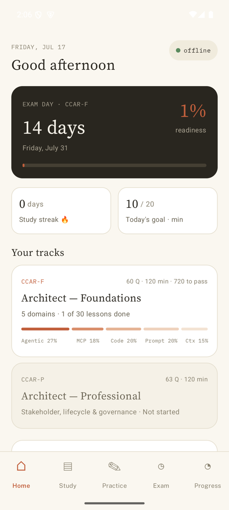
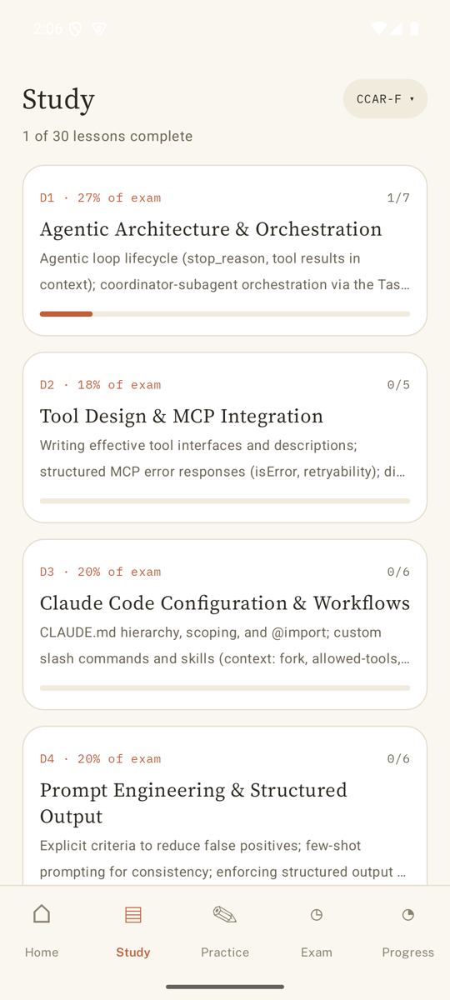
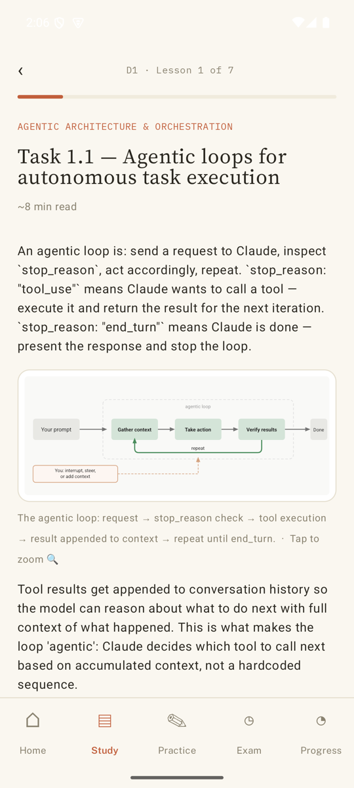
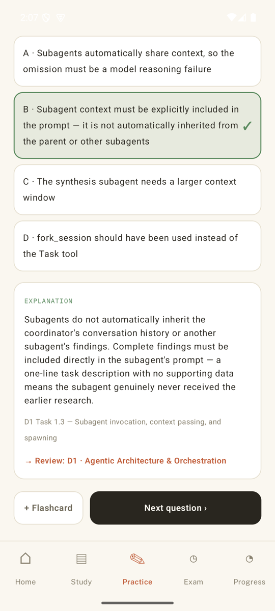
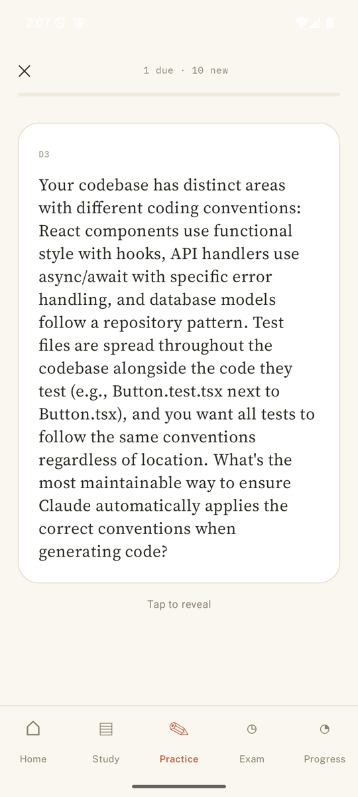
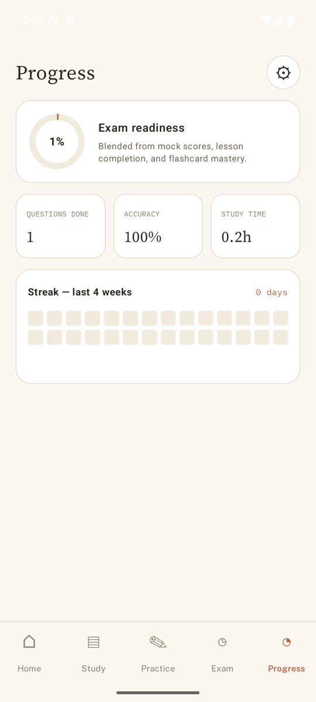
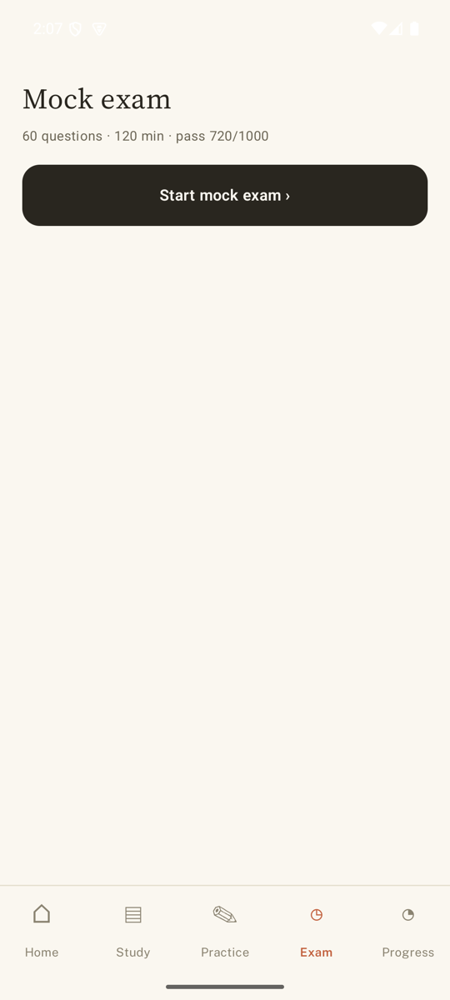
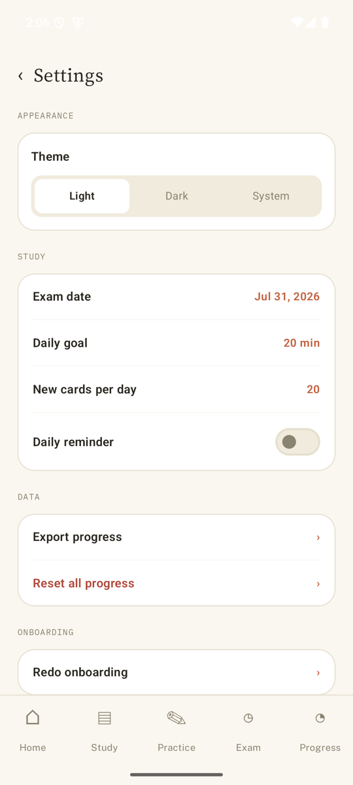
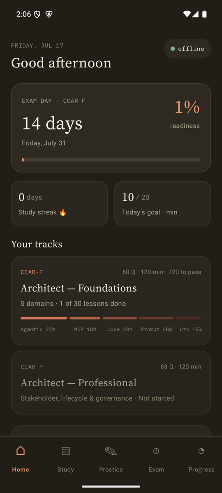

# Architect Exam Prep

An offline-first Kotlin + Jetpack Compose Android app for preparing for the
**Claude Certified Architect – Foundations (CCAR-F)** exam. All lessons,
practice questions, flashcards, and mock exams are bundled in the APK — the
app never connects to the internet.

## Screenshots

| Home | Study | Lesson |
|---|---|---|
|  |  |  |

| Practice | Flashcards | Progress |
|---|---|---|
|  |  |  |

| Mock exam | Settings | Dark theme |
|---|---|---|
|  |  |  |

## How to Use the App

### 1. First launch — Onboarding
Set your exam date and a daily study goal (minutes per day). Both can be
changed later in Settings. The Home screen then shows a countdown to exam
day and a blended **readiness score** computed from mock-exam results,
lesson completion, and flashcard mastery.

### 2. Study (📖 Study tab)
Lessons are organized into the 5 official exam domains, weighted exactly as
the real exam is (D1 Agentic 27%, D2 MCP 18%, D3 Code 20%, D4 Prompt 20%,
D5 Context 15%):

- Tap a domain card to see its lessons (one lesson per official task
  statement — 30 total).
- Inside a lesson: read the body, **tap any diagram to open a full-screen
  pinch-zoom viewer**, and press **"Mark done ›"** at the bottom to record
  progress and advance to the next lesson.
- The **Exam guide** card explains the exam format, scoring, and what to
  expect on the day; the **Glossary** card is a searchable term reference.

### 3. Practice (✏️ Practice tab)
- **Practice by domain**: answer single-choice questions with instant
  feedback and a full explanation. After answering you can jump to the
  related lessons via the **"→ Review: …"** link, or press **"+ Flashcard"**
  to queue that question into your flashcard deck.
- **Flashcards**: spaced-repetition review (SM-2 style). Tap a card to
  reveal the answer, then grade yourself Again / Hard / Good / Easy — the
  scheduler picks the next review date accordingly. "New cards per day" is
  configurable in Settings.

### 4. Mock exam (⏱ Exam tab)
A full-length timed simulation: 60 questions, 120 minutes, scaled score out
of 1,000 with 720 to pass — identical to the real exam format. You can flag
questions, navigate freely, and an in-progress attempt survives closing the
app. Results show your scaled score plus a per-domain breakdown so you know
where to focus.

### 5. Progress (◔ Progress tab)
Readiness ring, questions answered, accuracy, total study time, mock-score
trend, weak-area callouts, and a 4-week streak heat map. The gear icon opens
Settings (theme, exam date, daily goal, card limit, daily reminder, data
export, and full progress reset).

## Installing

Grab `app-debug.apk` from the latest [GitHub Actions build](../../actions)
(artifact `app-debug`), or build locally:

```bash
./gradlew :app:assembleDebug
# output: app/build/outputs/apk/debug/app-debug.apk
```

Then sideload: enable "Install unknown apps" on your phone and open the APK,
or use `adb install app-debug.apk`. Requires Android 8.0 (API 26) or newer.

## Technology Stack

- **Language**: Kotlin
- **UI**: Jetpack Compose + Material 3, single-activity bottom-tab navigation
- **Database**: Room (SQLite) with Flow-based observables
- **State**: MVVM — ViewModel + StateFlow
- **Preferences**: DataStore
- **Images**: Coil with SVG decoder for bundled diagrams
- **Serialization**: kotlinx.serialization for the content-pack pipeline
- **CI**: GitHub Actions builds the APK on every push (artifact retained 30 days)

## Project Structure

```
app/src/main/java/com/architectprep/app/
├── ui/            # Compose screens: home, study, practice, exam, progress,
│                  # settings, reference (guide/glossary), theme tokens
├── data/
│   ├── db/        # Room entities & DAOs (user progress is never touched
│   │              # by content re-imports — "golden rule")
│   ├── content/   # Bundled JSON content-pack import
│   └── prefs/     # DataStore user preferences
└── domain/        # Readiness calculator, SM-2 scheduler, streak tracker,
                   # mock-exam scoring

content/packs/ccar-f/   # Source of truth for lessons/questions/glossary JSON
design/                 # HTML design mockups + design-token README
docs/                   # Development design doc, knowledge base, screenshots
```

## Design System

- **Typography**: Source Serif 4 (headings), Public Sans (body), IBM Plex
  Mono (code/labels) — bundled as variable fonts
- **Colors**: warm paper palette with full light/dark themes; dedicated
  tokens for the dark hero card, the 5-step domain-weight ramp, and
  code/callout lesson blocks (see `app/.../ui/theme/Tokens.kt`)
- **Source of truth**: `design/README.md` and the mockups in `design/`

## Content: What's Inside and Where It Came From

The study content (30 lessons, 34 practice questions, glossary, exam guide)
lives in `content/packs/ccar-f/` and is imported into Room on first launch.
**All lesson text, glossary definitions, and 22 of the 34 questions are
originally written** for this project. The complete source log, including
what changed between content versions, is in
[content/SOURCES.md](content/SOURCES.md).

### Primary references

| Reference | Used for |
|---|---|
| **Claude Certified Architect – Foundations: Exam Guide** (Anthropic, v0.2, June 30 2026) | Authoritative source for domain names/weights, all 29 task statements, exam mechanics (60 Q / 120 min / 720-of-1000 pass), and the 12 official sample questions |
| **Anthropic Certification Exam Policy** (June 25 2026) | Exam-day rules reflected in the in-app Exam guide |
| **Certification Terms and Conditions** (Anthropic) | Program/IP constraints that shaped what this app does and doesn't reproduce |
| [Claude Managed Agents docs](https://platform.claude.com/docs/en/managed-agents/overview) | Background for D1 lessons |
| [Multiagent orchestration docs](https://platform.claude.com/docs/en/managed-agents/multiagent-orchestration) | Background for D1 lessons |
| [Agent Skills docs](https://platform.claude.com/docs/en/agents-and-tools/agent-skills/overview) | Background for D3 lessons |
| [Claude Code docs](https://code.claude.com/docs) | Background for D3 CLAUDE.md / hooks / skills lessons |
| [Building Effective Agents](https://www.anthropic.com/engineering/building-effective-agents) (Anthropic Engineering) | Background reading |

### On the 12 official sample questions

The Exam Guide is Anthropic's public preparation document and states that it
"provides sample questions" for exam preparation. Those 12 questions are
reproduced in the app **with attribution** (tagged `"official": true`, cited
as "Official Exam Guide — Sample Question N") and kept visibly separate from
the 22 originally-authored questions. No confidential exam content is — or
ever was — involved; see [content/SOURCES.md](content/SOURCES.md) for the
full reasoning.

> **Note**: This is an unofficial, personal study aid. It is not affiliated
> with or endorsed by Anthropic. Exam format details come from the v0.2
> Exam Guide and may change — always check Anthropic's latest official guide.

## Licensing

Three different things are bundled here, under three licenses:

| Component | License |
|---|---|
| **Application source code** | [MIT](LICENSE) — chosen because it's the simplest permissive license: anyone can use, modify, and redistribute the code, including commercially, with attribution |
| **Fonts** (Source Serif 4, Public Sans, IBM Plex Mono) | [SIL Open Font License 1.1](app/src/main/assets/fonts_licenses/) — the fonts' own license; full texts are bundled in the APK |
| **Study content** (`content/packs/`) | Original text © 2026 the author, usable under the same MIT terms as the code — *except* the 12 attributed sample questions, which remain © Anthropic and are reproduced here solely as published in their public Exam Guide |

If you fork this project, keep the font license files, keep the attribution
on the 12 official questions (or remove them), and don't present the app as
an official Anthropic product.

## License

MIT — see [LICENSE](LICENSE).
